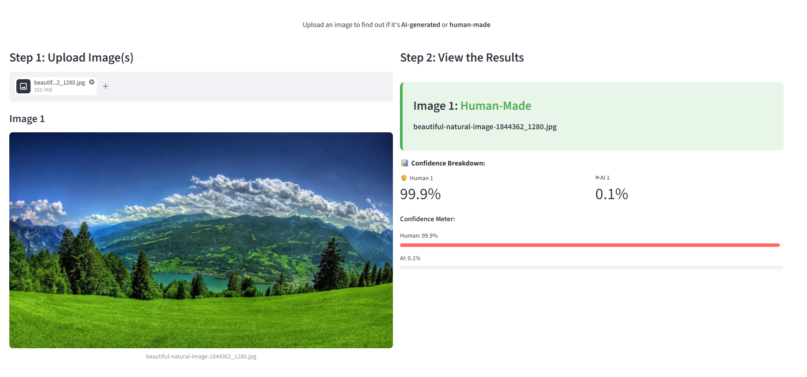

# Cosmos AI Art Detector

A convolutional neural network that decides whether an image was **AI-generated** or
**made by a human**, built and trained from scratch in PyTorch.

**Live demo:** [apps.leonzhao.dev/ai-art](https://apps.leonzhao.dev/ai-art/) (always on, no cold start)

Featured in context at [leonzhao.dev/ai/ai-art](https://leonzhao.dev/ai/ai-art/).



## The approach

The detector uses a **PatchCraft-style patch-voting CNN**. Instead of judging a whole
image at once, it looks at many small crops and votes, which forces the model to learn
the local texture artifacts that generators leave behind rather than memorizing global
composition.

1. The input image is resized to 128x128.
2. Ten random 64x64 patches are sampled from it.
3. A small CNN (3 conv blocks then a 2-layer classifier) scores each patch for the
   probability that it is AI-generated.
4. The ten patch probabilities are averaged into one verdict.

Training data: the Kaggle [AI vs Human Generated Dataset](https://www.kaggle.com/datasets/alessandrasala79/ai-vs-human-generated-dataset),
downloaded in the notebook via `kagglehub`. The full dataset is large and is **not**
committed here; only the trained weights (`models/Cosmos_Art_Detector.pth`, ~8 MB) ship
with the repo.

## Results

| Metric | Value |
|---|---|
| Validation accuracy | **97.7%** (improved from ~66% baseline to ~98% final) |
| Architecture | PatchCraft CNN (keys on the contrast between neighboring pixels) |
| Framework | PyTorch |

## Run it locally

```bash
pip install -r requirements.txt
streamlit run app.py
```

Then open the URL Streamlit prints (default http://localhost:8501) and upload an image.

## Training notebook

The model was trained in [`notebooks/training.ipynb`](notebooks/training.ipynb).

## License

[MIT](LICENSE).
